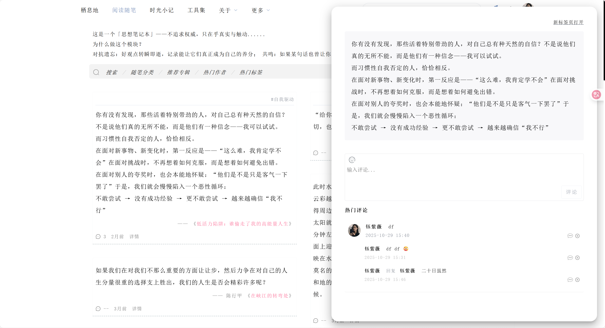
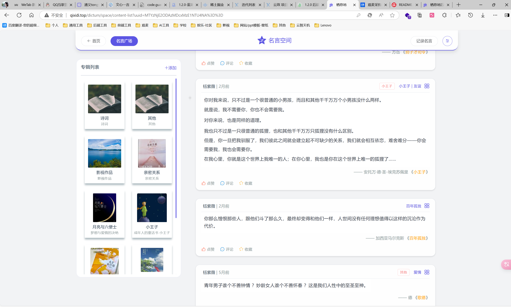
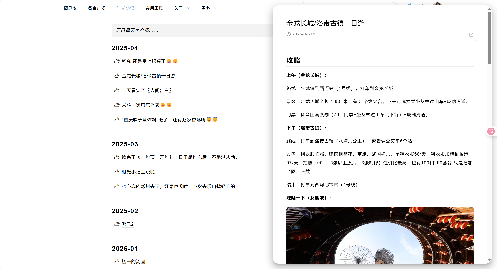
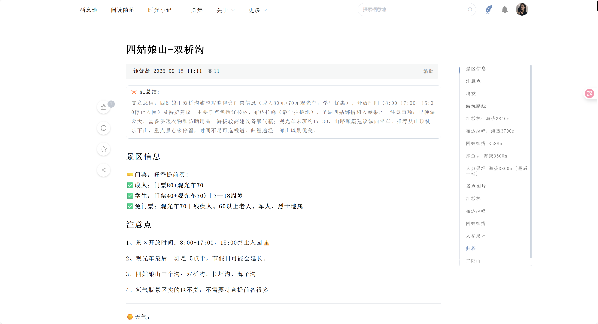
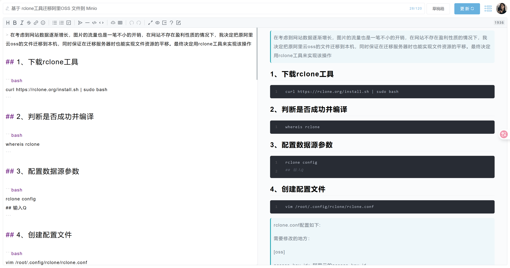
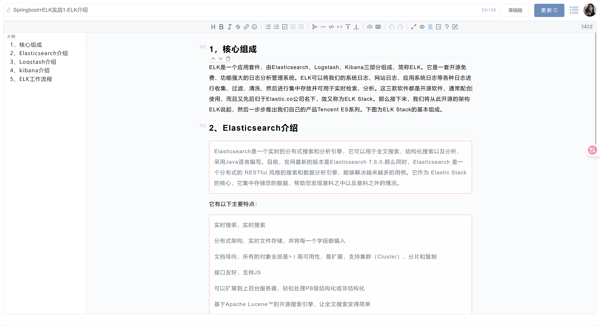
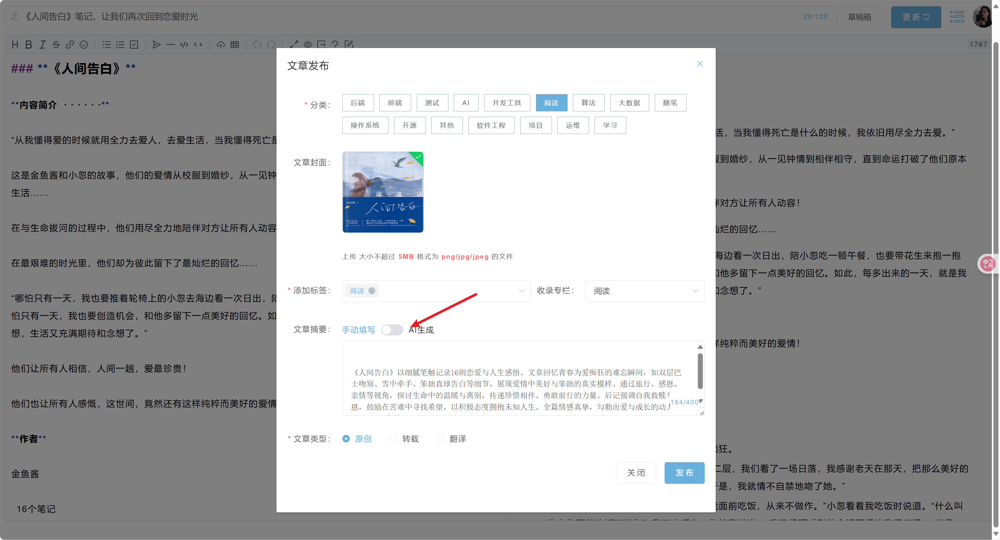
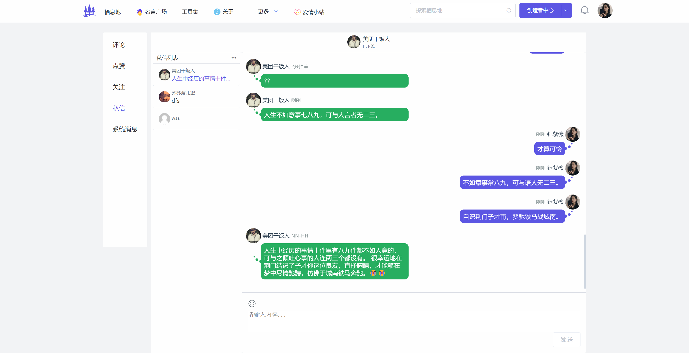

<p align=center>
   
<h1 align=center>栖息地 v-1.0</h1>
<p align="center">
</img>
</img>
</p>
</p>

## 前言🔥

为什么会有栖息地？在大学时光里，每天被新知识与理念环绕。我渴望找到一个地方，能够将这些宝贵的知识和感悟系统地整理、记录下来。

恰在此时，我邂逅了博客，它宛如一座私人的知识宝藏，能让我自由的记录下所学所思，随心分享，使其沉淀积累，且不受时空拘囿，无论何时何地，都能记录自己的成长变化与蜕变历程。
于是，我开启了搭建个人博客的探索旅程。😁

我的博客之旅始于 Hexo 静态网站，它为我打开了博客世界的大门，然而，随着技术钻研渐深，和受诸多精美博客启发，我逐渐萌生了打造专属博客的念头。
于是我的第一个多人博客 Tomorrow（我为其取了 “满怀憧憬” 的雅号）诞生了，它是基于 SpringBoot + Thymeleaf
构建而成的，作为我的第一个项目，整体的框架设计实在过于简陋且臃肿。 后来随着前后端分离开发模式兴起，Thymeleaf
渐趋式微，我也不愿再为这沉重的项目空耗心力，最终只能无奈将其搁置。

此后，幸遇Halo——一个出色的动态博客项目，在后面很长一段时间里，Halo 满足了我的创作需求。Halo
是一个很棒的动态博客，它提供了非常丰富的主题，社区也非常活跃，至今都没看到能与之相比的开源博客项目。👍

但随着时间的推移，我逐渐发现，尽管 Halo 非常优秀，但它依然无法完全契合我的需求。我渴望拥有一个能够完全按照我的意愿进行定制和美化的博客空间。
于是 Aurora（极光知识社区）诞生了，它是以开源项目 “RuoYi” 为基础二次开发而成。也是我的“毕业设计”。为了更好地优化SEO，我基于
Nuxt.js 对前台进行了重构，并赋予它新的名字——**栖息地**。😎

栖息地，这个名字不仅寓意着知识的汇聚与分享，更寄托了我对这片心灵净土的深深向往。在这个信息爆炸的时代，我们都需要一个可以安放思绪、沉淀自我的地方。它既是知识的港湾，亦是心灵的归巢。🤝

> **v1.0 版本**已归档，后续将不再维护（bug除外）。推荐使用v2.0版本：https://gitee.com/yu-zi-wei/qixidi/tree/master/

### 网站访问地址👉：https://qixidi.top/

### 开源地址（Gitee）：https://gitee.com/yu-zi-wei/qixidi

### 开源地址（GitHub）：https://github.com/yu-zi-wei/Qixidi-KnowledgeCommunity

### 目录结构

```text
qixidi/
│
└── qixidi-service  # 项目后端plus版本（基于SpringBoot-v3 + jdk17 完成）
    │
    ├── qixidi-startup # 后台启动模块
    │
    ├── framework # 核心框架
    │
    ├── qixidi-auth # 认证模块
    │
    ├── qixidi-business # 核心业务
    │
    ├── qixidi-system # 基础业务（原ruoyi项目业务逻辑）
    │
    ├── sql  # sql文件（暂不提供，需要可加微信（有偿：169元/包售后）：zsh2978824265）
    │
├── qixid-web  # 项目前台（Nuxt2.js）
│
└── qixidi-web-admin  # 项目后台（Vue.js）

```

> **数据库中提供了默认登录账号**
>
> **前台账号：**
>
> 账号：12345678@qq.com
>
> 密码：123456
>
> **后台账号：**
>
> 账号：admin
>
> 密码：123456

## 主要技术栈🏮

### 后端

| 名称           | 版本     | 说明      |
|--------------|--------|---------|
| SpringBoot   | 3.3.2  | 基础框架    |
| Sa-Token     | 1.37.0 | 认证框架    |
| Mybatis-Plus | 3.5.7  | 数据库框架   |
| Justauth     | 1.16.5 | 第三方登录框架 |
| websocket    | 3.4.2  | 长连接框架   |
| OSS          | 3.14.0 | 云存储     |
| Minio        | 8.3.8  | 云存储     |
| MySQL        | 8.0    | 数据库     |
| Redis        | 6.0    | 缓存      |

### 前端

| 名称           | 版本          | 说明          |
|--------------|-------------|-------------|
| Node         | v18.0~v22.0 | 基础环境        |
| Vue.js       | 2.0         | 基础框架        |
| Nuxt.js      | 2.0         | 基础框架        |
| Element-ui   | 2.15.14     | ui框架        |
| antv/g2plot  | 2.4.31      | 数据可视化框架     |
| AiEditor     | 1.2.2       | Makdwon 编辑器 |
| mavon-editor | 2.10.4      | Makdwon 编辑器 |
| vditor       | xx          | Makdwon 编辑器 |

### 部署文档

**服务端：** https://gitee.com/yu-zi-wei/qixidi/blob/master/qixidi-service-plus/README.md

**前端-前台：** https://gitee.com/yu-zi-wei/qixidi/blob/master/qixid-web-nuxt2/README.md

**前端-后台：** https://gitee.com/yu-zi-wei/qixidi/blob/master/qixidi-web-admin/README.md

### 技术架构图🍂


## 功能点🥧

### 前台功能点


### 前台页面截图（网站具体ui与截图可能存在部分差异，以实际网站ui为主）

<table>
<tr>
<td></td>
<td></td>
</tr>
<tr>
<td align="center">网站首页</td>
<td align="center">名言广场</td>
</tr>
<tr>
<td></td>
<td></td>
</tr>
<tr>
<td align="center">名言广场</td>
<td align="center">名言空间</td>
</tr>
<tr>
<td></td>
<td></td>
</tr>
<tr>
<td align="center">时光小记</td>
<td align="center">文章详情页</td>
</tr>
<tr>
<td></td>
<td></td>
</tr>
<tr>
<td align="center">文章编辑</td>
<td align="center">文章发布</td>
</tr>
<tr>
<td></td>
<td></td>
</tr>
<tr>
<td align="center">文章发布</td>
<td align="center">用户私信</td>
</tr>
<tr>
<td></td>
<td></td>
</tr>
<tr>
<td align="center">用户后台</td>
<td align="center">用户主页</td>
</tr>
</table>

### 后台功能点


### 后台页面截图（网站具体ui与截图可能存在部分差异，以实际网站ui为主）

<table>
<tr>
<td></td>
<td></td>
</tr>
<tr>
<td align="center">后台首页</td>
<td align="center">用户管理</td>
</tr>
<tr>
<td></td>
<td></td>
</tr>
<tr>
<td align="center">文章管理</td>
<td align="center">系统任务</td>
</tr>
<tr>
<td></td>
<td></td>
</tr>
<tr>
<td align="center">导航配置</td>
<td></td>
</tr>
</table>

## 最后☕

在这片浩瀚的数字海洋中，栖息地如同一盏温暖的灯塔，静静地照亮着每一个求知者的心灵之旅。它的诞生，源自一个简单而又炽热的梦想———创造一个既属于我，也属于每一位热爱知识、渴望表达的你的独特空间。

“问题咨询可以添加我的微信：zsh2978824265”


————帅哥美女们💓都看到这了，点个Star再走吧！！！😇
    
