<p align=center>
   
</p>
<h1 align=center>栖息地 v2.0</h1>
<p align="center">
</img>
</img>
</p>

## 前言

栖息地是一个开源的多人知识社区博客系统，它的诞生源于一个简单的想法——拥有一个完全属于自己的知识空间。

1.0 版本是基于 RuoYi 二次开发构建的，随着功能不断迭代，早期架构的局限逐渐暴露：代码耦合度高、难以维护、前端技术栈老化。与其在一个摇摇欲坠的地基上反复修补，不如推倒重来。

于是 2.0 诞生了。这不是一次简单的升级，而是从零开始的全面重构——**后端 Spring Boot 3 + Java 17，前端 Nuxt 3 + Vue 3 + Naive
UI，全程 AI 驱动开发**。

> **1.0 版本**已归档至 [main-v1.0](https://gitee.com/yu-zi-wei/qixidi/tree/main-v1.0/) 分支，不再维护（bug 除外）。

### 网站地址：https://qixidi.top/

### 开源地址（Gitee）：https://gitee.com/yu-zi-wei/qixidi

### 开源地址（GitHub）：https://github.com/yu-zi-wei/Qixidi-KnowledgeCommunity

### 默认账号密码（仅限本地）
> 前台：123@qq.com/123456
> 
> 后台：admin/123456
---

## 目录结构

```text
qixidi/
│
└── qixidi-service  # 项目后端plus版本（基于SpringBoot-v3 + jdk17 完成）
    │
    ├── qixidi-startup # 后台启动模块
    │
    ├── framework # 核心框架
    │
    ├── qixidi-auth # 认证模块
    │
    ├── qixidi-business # 核心业务
    │
    ├── qixidi-system # 基础业务（原ruoyi项目业务逻辑）
    │
    ├── sql  # sql文件（暂不提供，需要可加微信（请注明来意，sql是有偿的：169元/包售后）：zsh2978824265）
    │
├── qixid-web-nuxt3  # 项目前台（Nuxt3.js）
│
└── qixidi-web-admin  # 项目后台（Vue.js）

```

## 亮点特性

除了常规博客功能，栖息地还有一些让你眼前一亮的特性：

**Markdown 编辑器内置多媒体支持**

- 直接嵌入 **B 站视频**，输入视频链接即可预览播放
- 支持 YouTube、本地视频上传等多种视频来源
- 一键切换 **AI 自动生成摘要**，告别手动写摘要的烦恼

**实时社交互动**

- 基于 WebSocket 的**实时私信**和**消息通知**
- 三级嵌套评论、表情选择器，互动体验不打折
- 关注、点赞、收藏，完整的社区互动链路

**现代阅读体验**

- SSR 服务端渲染，首屏秒开，SEO 友好
- 浅色/深色主题一键切换，护眼不打烊
- 全站响应式设计，手机端也能舒适阅读

**内容管理**

- 阅读随笔：打造你的专属读书笔记空间
- 小记功能：随时记录灵感碎片
- 文章合集：自定义收藏夹，分类整理文章

---

## 主要技术栈

### 后端

| 名称               | 版本     | 说明     |
|------------------|--------|--------|
| Spring Boot      | 3.3.2  | 基础框架   |
| Sa-Token         | 1.37.0 | 认证框架   |
| MyBatis-Plus     | 3.5.7  | ORM 框架 |
| Spring WebSocket | 3.4.2  | 长连接    |
| Aliyun OSS       | 3.14.0 | 云存储    |
| MinIO            | 8.3.8  | 对象存储   |
| MySQL            | 8.0    | 数据库    |
| Redis            | 6.0    | 缓存     |

### 前端

| 名称             | 版本   | 说明     |
|----------------|------|--------|
| Node.js        | v21+ | 运行环境   |
| Nuxt           | 3.21 | SSR 框架 |
| Vue            | 3.x  | 前端框架   |
| Naive UI       | 2.43 | UI 组件库 |
| Pinia          | 3.0  | 状态管理   |
| Tailwind CSS   | 4.2  | 工具类样式  |
| @vicons/tabler | 0.13 | 图标库    |

### 技术架构图


---

## 页面预览

### 前台

<table>
<tr>
<td>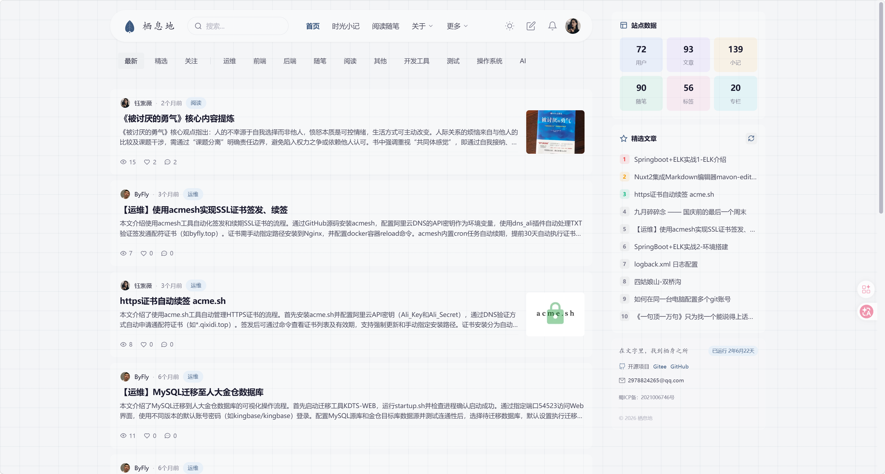</td>
<td>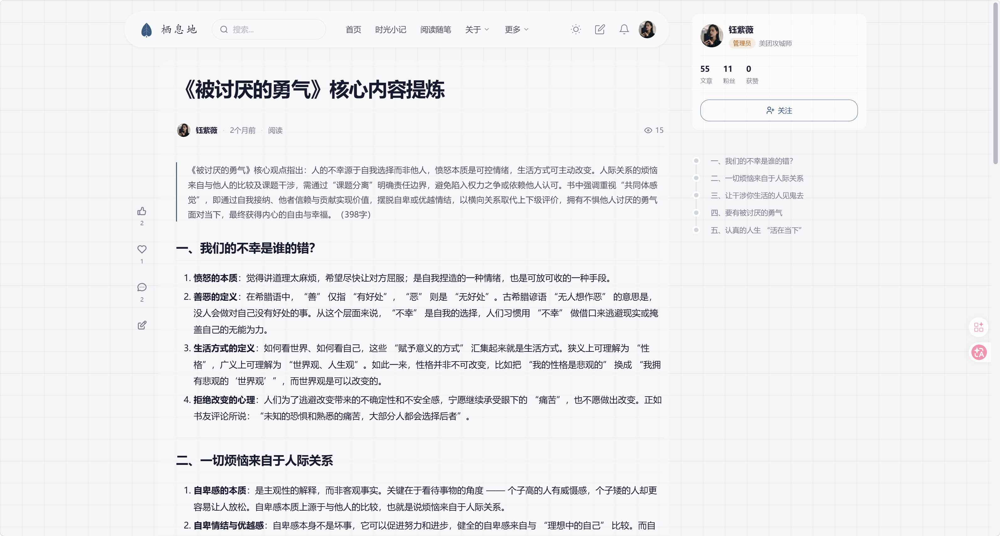</td>
</tr>
<tr>
<td align="center">首页</td>
<td align="center">文章详情页</td>
</tr>
<tr>
<td>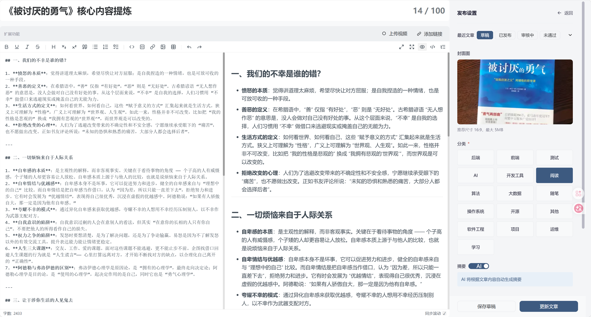</td>
<td>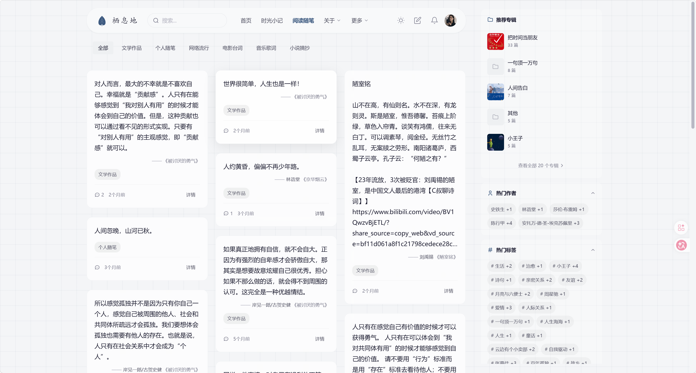</td>
</tr>
<tr>
<td align="center">文章编辑发布（支持 B 站视频嵌入）</td>
<td align="center">阅读随笔</td>
</tr>
<tr>
<td>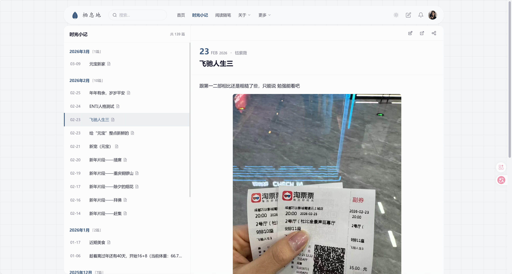</td>
<td>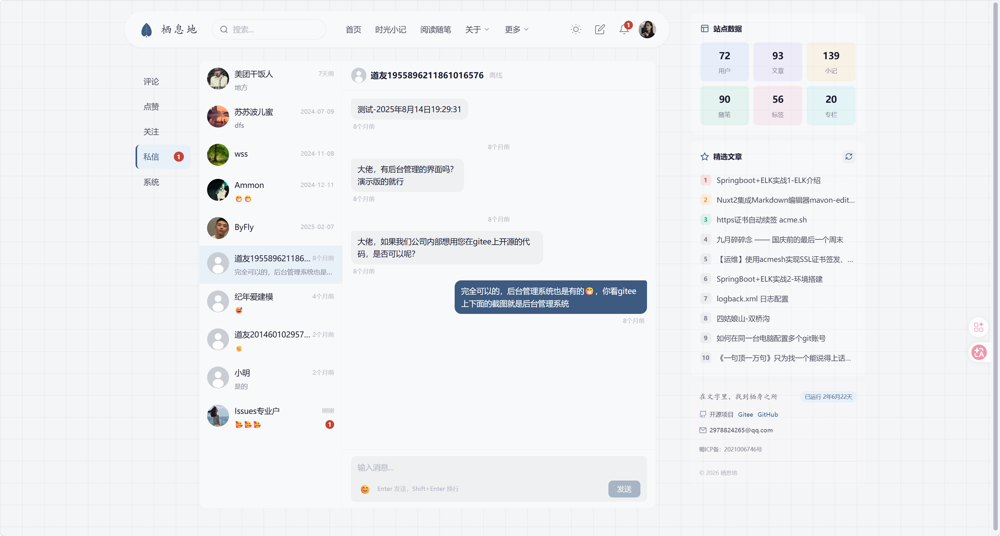</td>
</tr>
<tr>
<td align="center">小记</td>
<td align="center">实时私信</td>
</tr>
<tr>
<td>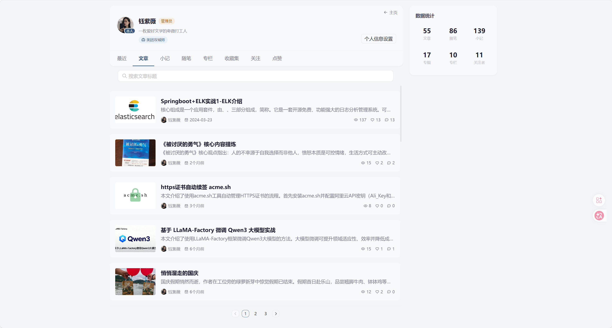</td>
<td>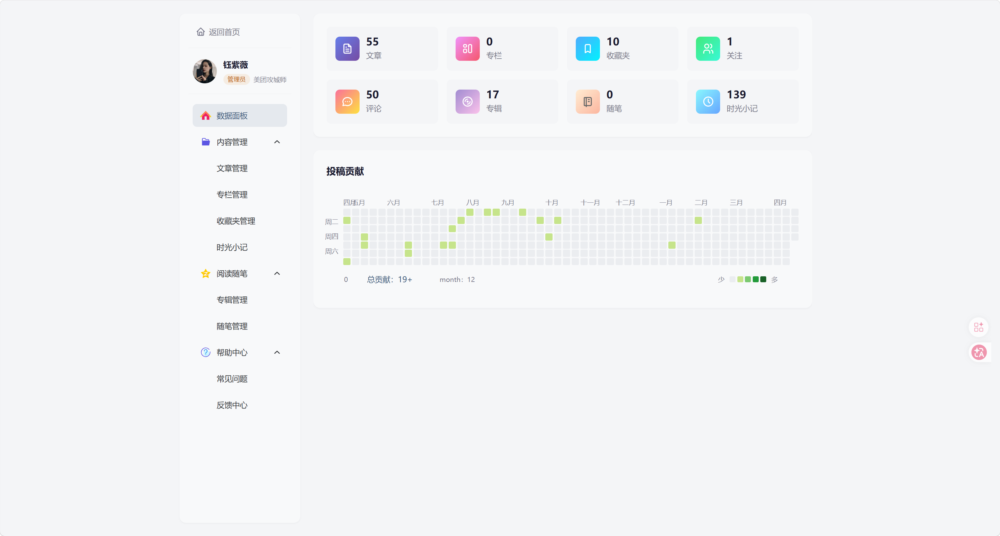</td>
</tr>
<tr>
<td align="center">用户主页</td>
<td align="center">用户后台</td>
</tr>
</table>

### 后台

<table>
<tr>
<td>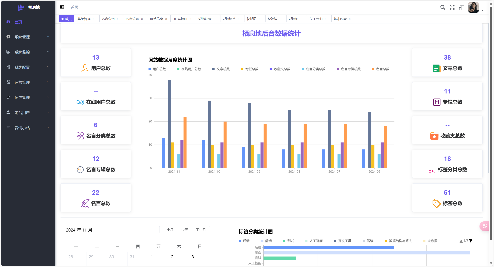</td>
<td>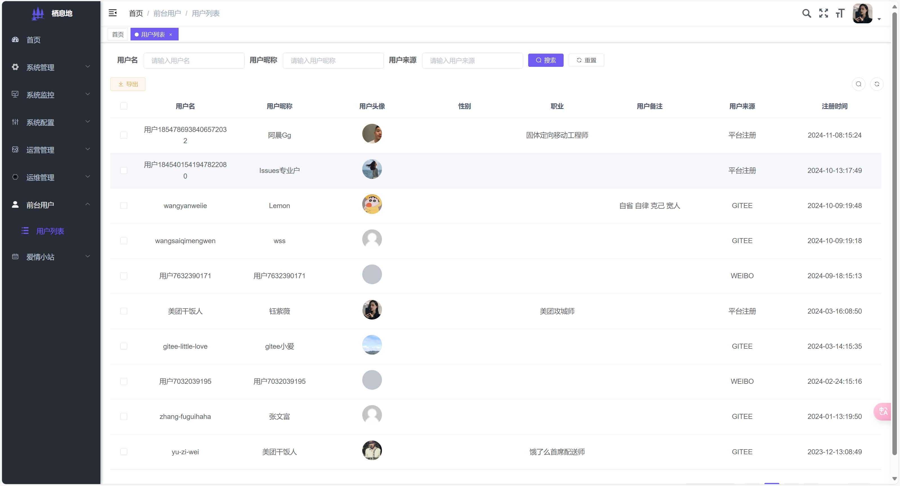</td>
</tr>
<tr>
<td align="center">后台首页</td>
<td align="center">用户管理</td>
</tr>
<tr>
<td>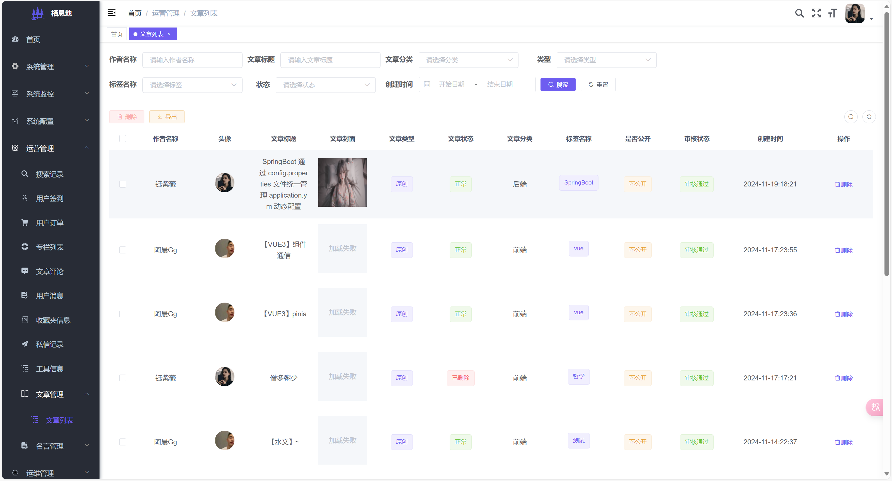</td>
<td>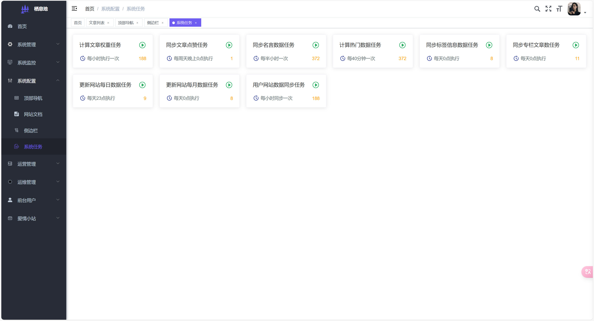</td>
</tr>
<tr>
<td align="center">文章管理</td>
<td align="center">系统任务</td>
</tr>
<tr>
<td>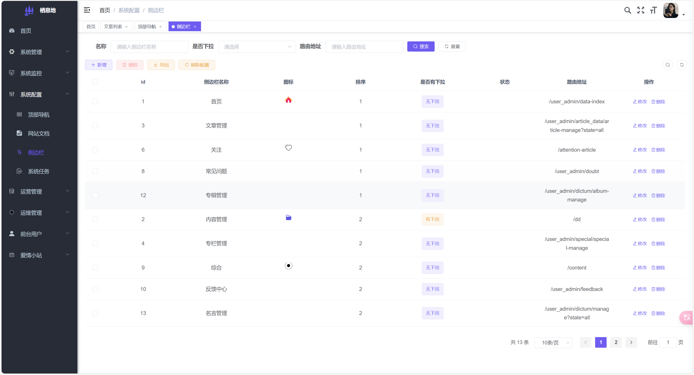</td>
<td></td>
</tr>
<tr>
<td align="center">导航配置</td>
<td></td>
</tr>
</table>

---

## 功能点

### 前台功能点


### 后台功能点


---

---

## 最后

问题咨询可以添加我的微信：zsh2978824265


————帅哥美女们看到这了，点个 Star 再走吧！
